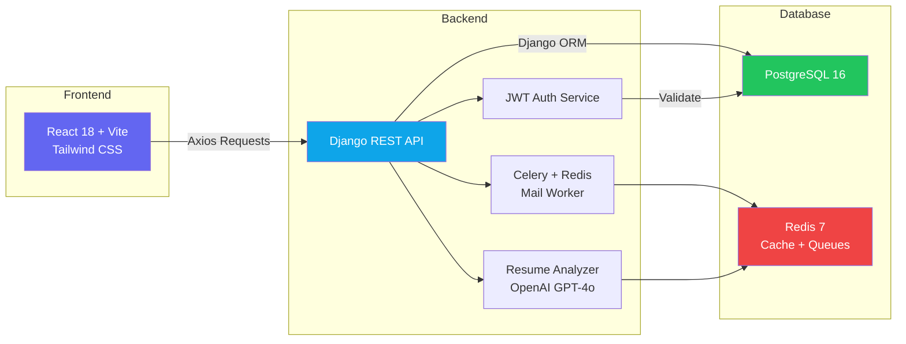
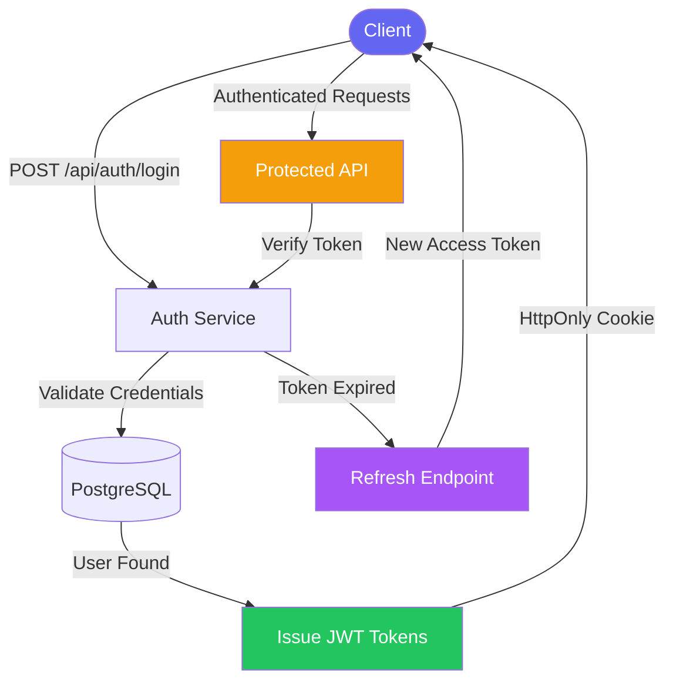
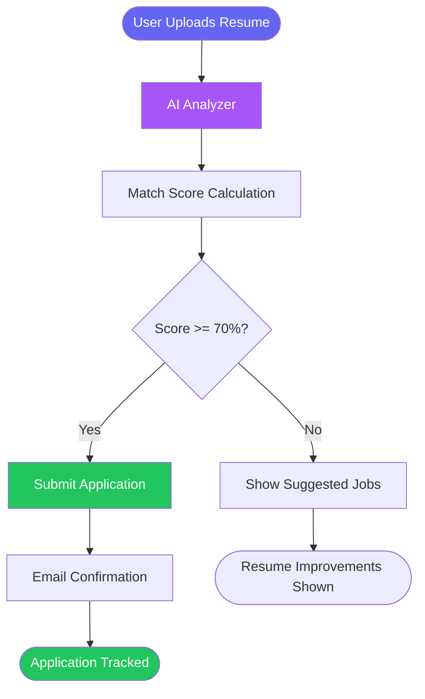
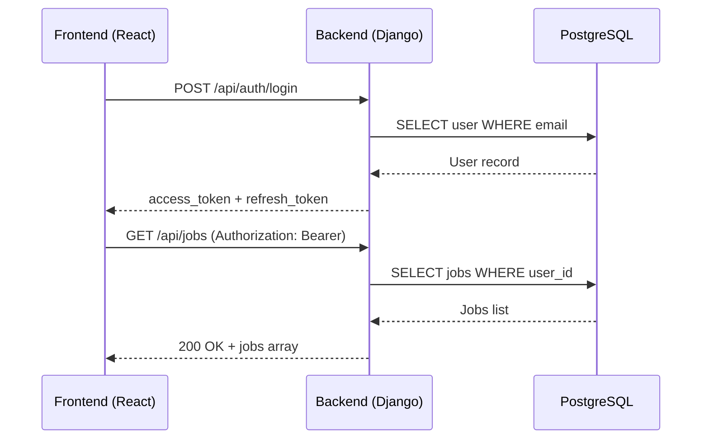
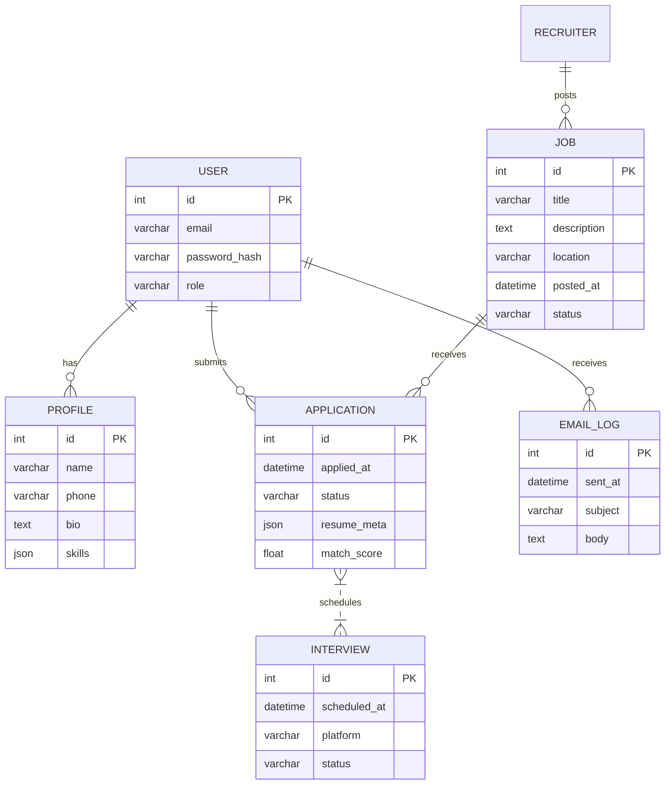

<div align="center">


<br/>

[](https://github.com/your-username/smart-job-tracker/stargazers)
[](https://github.com/your-username/smart-job-tracker/network)
[](LICENSE)
[](https://github.com/your-username/smart-job-tracker/actions)

[](https://vercel.com)
[](https://render.com)
[](https://djangoproject.com)
[](https://reactjs.org)
[](https://openai.com)

<br/>

> **Turn every job application into actionable intelligence.**  
> Smart Job Tracker is a full-stack, AI-enhanced SaaS platform that manages the entire recruitment lifecycle — from resume upload and AI skill extraction to interview scheduling, real-time analytics, and automated reminders.

<br/>

[](https://drive.google.com/file/d/1CT93uGtsCz8T9aqIskx-DGWaGwVofB7y/view?usp=sharing)

</div>

---

## 📋 Table of Contents

- [✨ Features](#-features)
- [🏗️ Architecture](#️-architecture)
- [🔐 Authentication Flow](#-authentication-flow)
- [🛠️ Tech Stack](#️-tech-stack)
- [📁 Folder Structure](#-folder-structure)
- [⚡ Quick Start](#-quick-start)
- [🔧 Environment Variables](#-environment-variables)
- [🌐 API Reference](#-api-reference)
- [🗄️ Database Schema](#️-database-schema)
- [☁️ Deployment](#️-deployment)
- [🔮 Roadmap](#-roadmap)
- [🤝 Contributing](#-contributing)
- [📄 License](#-license)

---

## ✨ Features

<table>
<tr>
<td width="50%">

### 👤 For Job Seekers
- 🔐 **JWT Auth** with refresh tokens & HttpOnly cookies
- 📄 **AI Resume Analyzer** — skill extraction, experience scoring, match %
- 📅 **Interview Scheduler** — Calendly-style slot picker + Google Calendar sync
- 📊 **Application Timeline** — status tracking with notes & history
- 🔔 **Notifications Hub** — email & in-app alerts
- 🤖 **AI Insights** — personalized next-step suggestions

</td>
<td width="50%">

### 🏢 For Recruiters / Admins
- 🗂️ **Kanban Pipeline** — New → Reviewed → Interview → Offer → Hired
- 📈 **Analytics Dashboard** — conversion funnels, source attribution, time-to-hire
- 📋 **Job Board** — CRUD jobs, statuses, interview stages
- 👥 **Recruiter Management** — create, edit, deactivate accounts
- 📧 **Email Templates** — customizable reminder policies
- ⚙️ **System Settings** — AI model selection, SaaS configs

</td>
</tr>
</table>

<div align="center">

| 🛡️ RBAC | 🌐 REST API | 🎨 Dark Mode | 🔄 CI/CD | ☁️ Cloud-Native | 📱 Responsive |
|:---:|:---:|:---:|:---:|:---:|:---:|
| Role-Based Access Control | OpenAPI Versioned | Dark-mode Ready UI | GitHub Actions | Vercel + Render | Mobile-First |

</div>

---

## 🏗️ Architecture



---

## 🔐 Authentication Flow



---

## 📊 Application Workflow



---

## 🛠️ Tech Stack

<div align="center">

| Layer | Technology | Purpose |
|:------|:-----------|:--------|
| **⚛️ Frontend** | React 18, Vite, Tailwind CSS, Axios, React-Router-DOM | UI & Client Routing |
| **🐍 Backend** | Python 3.11, Django 4.2, Django REST Framework | API & Business Logic |
| **🔐 Auth** | `djangorestframework-simplejwt`, HttpOnly Cookies | Access + Refresh Tokens |
| **🗄️ Database** | PostgreSQL 16 | Persistent Data Storage |
| **⚡ Cache / Queue** | Redis 7 + Celery | Job Queues & Caching |
| **🤖 AI** | OpenAI GPT-4o, LangChain | Resume Parsing & Insights |
| **📧 Email** | Celery Workers, SendGrid SMTP | Notifications & Reminders |
| **🔄 CI/CD** | GitHub Actions | Lint → Test → Build → Deploy |
| **☁️ Hosting** | Vercel (FE), Render / AWS ECS (BE) | Scalable Deployments |
| **🧪 Testing** | Jest, React Testing Library, PyTest | Unit + Integration Coverage |

</div>

---

## 📁 Folder Structure

```
smart-job-tracker/
│
├── 📁 .github/
│   └── ci.yml                    # GitHub Actions workflows
│
├── 📁 backend/
│   ├── manage.py
│   ├── 📁 smart_job_tracker/
│   │   ├── settings.py
│   │   ├── urls.py
│   │   └── wsgi.py
│   ├── 📁 apps/
│   │   ├── 📁 users/             # Auth, profiles, RBAC
│   │   ├── 📁 jobs/              # Job listings, applications, interviews
│   │   └── 📁 analytics/         # KPIs, dashboards, reports
│   └── requirements.txt
│
├── 📁 frontend/
│   ├── index.html
│   ├── 📁 src/
│   │   ├── main.jsx
│   │   ├── App.jsx
│   │   ├── 📁 routes/            # Protected & public routes
│   │   └── 📁 components/        # Reusable UI components
│   ├── vite.config.ts
│   └── tailwind.config.cjs
│
├── 📁 docs/
│   └── architecture.md
├── 📁 scripts/
│   └── deploy.sh
├── .env.example
├── LICENSE
└── README.md
```

---

## ⚡ Quick Start

### Prerequisites


### 1️⃣ Clone the Repository

```bash
git clone https://github.com/your-username/smart-job-tracker.git
cd smart-job-tracker
```

### 2️⃣ Frontend Setup

```bash
cd frontend

# Install dependencies
npm install

# Start dev server → http://localhost:5173
npm run dev
```

### 3️⃣ Backend Setup

```bash
cd ../backend

# Create and activate virtual environment
python -m venv venv
source venv/bin/activate          # Windows: venv\Scripts\activate

# Install dependencies
pip install -r requirements.txt

# Run database migrations
python manage.py migrate

# Create admin superuser
python manage.py createsuperuser

# Start development server → http://localhost:8000
python manage.py runserver
```

### 4️⃣ Configure Environment

```bash
cp .env.example .env
# Fill in your values (see Environment Variables section)
```

> 💡 **Tip:** Use Docker Compose for a one-command local setup with PostgreSQL + Redis already configured.

---

## 🔧 Environment Variables

Create a `.env` file at the project root. See `.env.example` for a template.

| Variable | Description | Example |
|:---------|:------------|:--------|
| `DJANGO_SECRET_KEY` | Django secret key | `super-secret-key-here` |
| `POSTGRES_DB` | PostgreSQL database name | `smartjobdb` |
| `POSTGRES_USER` | Database user | `postgres` |
| `POSTGRES_PASSWORD` | Database password | `securepassword` |
| `POSTGRES_HOST` | Database host | `localhost` |
| `REDIS_URL` | Redis connection string | `redis://localhost:6379/0` |
| `JWT_SECRET_KEY` | JWT signing secret | `jwt-secret-key` |
| `OPENAI_API_KEY` | OpenAI API key | `sk-...` |
| `VITE_API_URL` | Frontend API endpoint | `http://localhost:8000/api/` |
| `EMAIL_HOST` | SMTP host | `smtp.sendgrid.net` |
| `EMAIL_HOST_USER` | SMTP username | `apikey` |
| `EMAIL_HOST_PASSWORD` | SMTP password | `SG.xxxxx` |

> ⚠️ **Never commit your `.env` file.** It's already in `.gitignore`.

---

## 🌐 API Reference



> 📖 Full OpenAPI spec available at `/api/schema/` when running the backend.

---

## 🗄️ Database Schema



---

## ☁️ Deployment

<table>
<tr>
<th width="33%">⚡ Vercel (Frontend)</th>
<th width="33%">🟢 Render (Backend)</th>
<th width="33%">☁️ AWS (Enterprise)</th>
</tr>
<tr>
<td>

1. Connect GitHub repo
2. Set `VITE_API_URL` to backend URL
3. Deploy — auto-detects Vite

</td>
<td>

1. Create a **Web Service**
2. Build: `pip install -r requirements.txt && python manage.py collectstatic`
3. Start: `gunicorn smart_job_tracker.wsgi:application`
4. Add all env vars

</td>
<td>

1. **ECS** + **RDS** for containers
2. Secrets via **AWS Secrets Manager**
3. **ALB** for HTTPS termination
4. **CloudFront** CDN for frontend

</td>
</tr>
</table>

---

## 🔮 Roadmap

- [ ] 🤖 **AI Job Matching** — recommend openings based on resume & skill gaps
- [ ] 🌍 **Multilingual Support** — translate UI & email notifications
- [ ] 📆 **Advanced Scheduler** — Outlook & Calendly API integrations
- [ ] 📡 **SLA Monitoring** — Prometheus + Grafana ops dashboards
- [ ] 📱 **Mobile Apps** — React Native for iOS & Android
- [ ] 🔗 **LinkedIn Integration** — one-click profile import
- [ ] 💬 **In-App Messaging** — recruiter ↔ applicant chat

---

## 🤝 Contributing

Contributions are welcome and appreciated! Here's how to get started:

```bash
# 1. Fork the repo and clone your fork
git clone https://github.com/YOUR_USERNAME/smart-job-tracker.git

# 2. Create a feature branch
git checkout -b feat/your-awesome-feature

# 3. Make changes, then lint
npm run lint        # Frontend
flake8 .            # Backend

# 4. Run tests (aim for ≥80% coverage)
npm test            # Frontend
pytest --cov        # Backend

# 5. Push and open a Pull Request
git push origin feat/your-awesome-feature
```

Please read [CONTRIBUTING.md](CONTRIBUTING.md) for our code style guide and code of conduct.

---

## 📄 License

Distributed under the **MIT License**. See [`LICENSE`](LICENSE) for details.

---

<div align="center">


**Made by [sridhar manohar](https://github.com/sridharSTR)**

[](https://github.com/sridharSTR)


</div>
