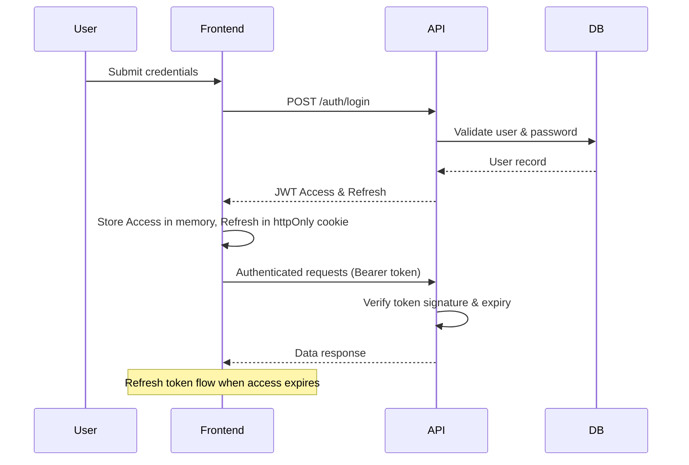
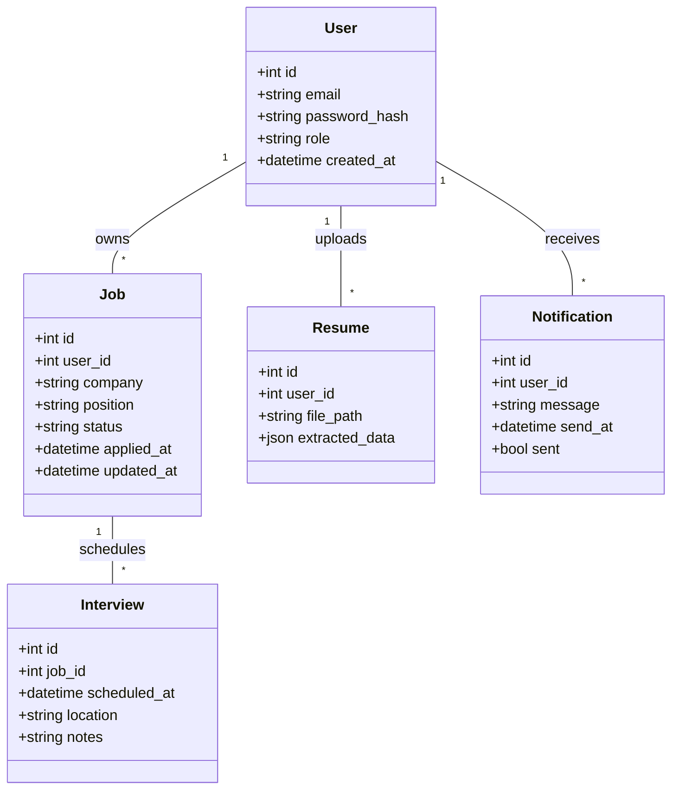

<div align="center">
# 🟢 **Smart Job Tracker**


---

## 📖 Project Overview

**Smart Job Tracker** is an AI‑powered SaaS platform that empowers job seekers to organize, analyze, and accelerate their job‑search journey.  Leveraging intelligent resume parsing, interview scheduling, and real‑time analytics, the platform delivers a seamless, recruiter‑friendly experience from the moment a user signs up to the final interview.

---

## ✨ Key Features

- 🔐 **User Authentication** – Secure JWT‑based login & role‑based access (Applicant, Recruiter, Admin)
- 📂 **Job Application Tracking** – CRUD workflow for applications, status pipelines, and notes
- 📄 **Resume Upload & Analyzer** – AI‑driven extraction of skills, experience, and match scoring
- 📆 **Interview Scheduling** – Calendar integration with reminders & time‑zone handling
- ⏰ **Reminder Notifications** – Email & in‑app alerts for deadlines and follow‑ups
- 🛠️ **Recruiter/Admin Dashboard** – Candidate pool, analytics, and admin controls
- 📈 **Analytics Dashboard** – Visual insights (applications per stage, response rates, etc.)
- 🎨 **SaaS UI Design** – Modern, responsive, dark‑mode ready UI built with Tailwind CSS
- 🌐 **REST APIs** – Fully documented endpoints powered by Django REST Framework
- 🔐 **JWT Security** – Access/Refresh token flow with rotating secrets

---

## 🛠️ Tech Stack Badges

[](https://reactjs.org/)
[](https://vitejs.dev/)
[](https://tailwindcss.com/)
[](https://www.python.org/)
[](https://www.djangoproject.com/)
[](https://www.django-rest-framework.org/)
[](https://www.postgresql.org/)
[](https://redis.io/)
[](https://github.com/features/actions)
[](https://vercel.com/)
[](https://aws.amazon.com/)

---

## 🏗️ System Architecture

```mermaid
flowchart TB
    subgraph Frontend[Frontend (React + Vite)]
        FE[React SPA] -->|Axios| API[REST API Gateway]
    end
    subgraph Backend[Backend (Django + DRF)]
        API --> Auth[JWT Auth Service]
        API --> Jobs[Job Service]
        API --> Resume[Resume Analyzer]
        API --> Schedule[Interview Scheduler]
        API --> Notify[Notification Service]
        API --> Admin[Admin Dashboard]
    end
    subgraph Database[Data Stores]
        PG[(PostgreSQL)]
        Redis[(Redis Cache)]
    end
    subgraph Infra[Infrastructure]
        Vercel[Vercel (Frontend)]
        AWS[Render / AWS (Backend)]
        CI[GitHub Actions CI/CD]
    end
    FE -->|Deploy| Vercel
    Backend -->|Deploy| AWS
    CI -->|Build & Test| Frontend & Backend
    Jobs --> PG
    Auth --> PG
    Resume --> PG
    Schedule --> PG
    Notify --> Redis
    Admin --> PG
```

---

## 📂 Folder Structure

```
smart_job_tracker/
├─ backend/
│  ├─ config/            # Django settings
│  ├─ apps/
│  │   ├─ authentication/
│  │   ├─ jobs/
│  │   ├─ resume_analyzer/
│  │   ├─ scheduler/
│  │   └─ notifications/
│  ├─ manage.py
│  └─ requirements.txt
├─ frontend/
│  ├─ src/
│  │   ├─ components/
│  │   ├─ pages/
│  │   ├─ routes/
│  │   ├─ services/api.js
│  │   └─ App.jsx
│  ├─ index.html
│  ├─ vite.config.ts
│  └─ tailwind.config.js
├─ docs/
│  └─ architecture.md
├─ .github/workflows/
│  └─ ci.yml
├─ Dockerfile
├─ docker-compose.yml
├─ README.md
└─ .gitignore
```

---

## ⚙️ Installation

### Prerequisites

- **Node.js** >= 20
- **Python** >= 3.11
- **Docker** (optional, for quick local env)
- **PostgreSQL** server & **Redis** instance

### Clone the Repository

```bash
git clone https://github.com/your-username/smart-job-tracker.git
cd smart-job-tracker
```

---

## 🐍 Backend Setup

1. **Create a virtual environment**
   ```bash
   python -m venv .venv
   source .venv/Scripts/activate   # Windows
   # or `source .venv/bin/activate` on Unix
   ```
2. **Install dependencies**
   ```bash
   pip install -r backend/requirements.txt
   ```
3. **Apply migrations**
   ```bash
   cd backend
   python manage.py migrate
   ```
4. **Create a superuser**
   ```bash
   python manage.py createsuperuser
   ```
5. **Run the development server**
   ```bash
   python manage.py runserver
   ```
   The API will be available at `http://127.0.0.1:8000/api/`.

---

## ⚛️ Frontend Setup

```bash
cd frontend
npm install
npm run dev   # Vite dev server on http://localhost:5173
```

The frontend proxies API calls to the backend (see `vite.config.ts`).

---

## 🌐 Environment Variables

### Backend (`backend/.env`)
| Variable | Description |
|---|---|
| `DJANGO_SECRET_KEY` | Django secret key |
| `POSTGRES_DB` | PostgreSQL database name |
| `POSTGRES_USER` | PostgreSQL username |
| `POSTGRES_PASSWORD` | PostgreSQL password |
| `POSTGRES_HOST` | Host (e.g., `localhost`) |
| `POSTGRES_PORT` | Port (default `5432`) |
| `REDIS_HOST` | Redis host |
| `REDIS_PORT` | Redis port |
| `JWT_ACCESS_LIFETIME` | Access token lifetime (e.g., `15m`) |
| `JWT_REFRESH_LIFETIME` | Refresh token lifetime (e.g., `7d`) |

### Frontend (`frontend/.env`)
| Variable | Description |
|---|---|
| `VITE_API_BASE_URL` | Base URL for backend API (e.g., `http://localhost:8000/api/`) |
| `VITE_APP_NAME` | Display name of the SaaS |

> **⚠️ Note:** Do **not** commit `.env` files to version control.

---

## 📜 API Endpoints Overview

| Method | Endpoint | Description |
|---|---|---|
| `POST` | `/api/auth/login/` | Obtain JWT access & refresh tokens |
| `POST` | `/api/auth/refresh/` | Refresh access token |
| `POST` | `/api/auth/register/` | Register new applicant |
| `GET` | `/api/jobs/` | List all tracked jobs |
| `POST` | `/api/jobs/` | Create a new job entry |
| `PATCH` | `/api/jobs/{id}/` | Update job status/notes |
| `DELETE` | `/api/jobs/{id}/` | Delete a job record |
| `POST` | `/api/resume/upload/` | Upload & analyze resume |
| `GET` | `/api/interviews/` | Fetch scheduled interviews |
| `POST` | `/api/interviews/` | Schedule a new interview |
| `GET` | `/api/notifications/` | List pending reminders |
| `GET` | `/api/admin/dashboard/` | Admin‑level analytics (protected) |

---

## 🔐 Authentication Flow



---

## 🗄️ Database Design Overview



---

## 🚀 Deployment Guide

### Frontend (Vercel)
1. Push the `frontend/` folder to a GitHub repo.
2. Connect the repo to Vercel and set the **Build Command** to `npm run build` and **Output Directory** to `dist`.
3. Add environment variable `VITE_API_BASE_URL` pointing to the backend endpoint.

### Backend (Render / AWS Elastic Beanstalk)
1. Create a **Render** Web Service (or Elastic Beanstalk app) using the Dockerfile.
2. Set the following env vars in the service dashboard (see *Environment Variables* section).
3. Configure PostgreSQL and Redis add‑ons or external managed instances.
4. Enable **Auto‑Deploy** on main branch pushes.

---

## 🛠️ CI/CD Workflow (GitHub Actions)

```yaml
name: CI
on:
  push:
    branches: [ main ]
  pull_request:
    branches: [ main ]
jobs:
  backend:
    runs-on: ubuntu-latest
    services:
      postgres:
        image: postgres:16
        env:
          POSTGRES_USER: user
          POSTGRES_PASSWORD: password
          POSTGRES_DB: smart_job_tracker
        ports: [5432:5432]
      redis:
        image: redis:7
        ports: [6379:6379]
    steps:
      - uses: actions/checkout@v3
      - name: Set up Python
        uses: actions/setup-python@v4
        with:
          python-version: '3.11'
      - name: Install dependencies
        working-directory: ./backend
        run: |
          python -m venv .venv
          source .venv/bin/activate
          pip install -r requirements.txt
      - name: Run tests
        working-directory: ./backend
        run: |
          source .venv/bin/activate
          python manage.py test

  frontend:
    runs-on: ubuntu-latest
    steps:
      - uses: actions/checkout@v3
      - name: Set up Node
        uses: actions/setup-node@v3
        with:
          node-version: '20'
      - name: Install dependencies
        working-directory: ./frontend
        run: npm ci
      - name: Lint & Build
        working-directory: ./frontend
        run: |
          npm run lint
          npm run build
```

---

## 📸 Screenshots (Placeholder)

> *Add screenshots of the dashboard, job list, and interview scheduler here.*

```markdown


```

---

## 🔮 Future Enhancements

- 🤖 **AI‑powered job recommendation engine** using LLMs
- 🌍 **Multi‑language support** with i18n
- 📱 **Mobile application** (React Native)
- 📊 **Advanced analytics** (Cohort analysis, funnel visualization)
- 🧩 **Plugin marketplace** for third‑party integrations (e.g., LinkedIn, GitHub)

---

## 🤝 Contributing

We welcome contributions! Please follow these steps:

1. Fork the repository.
2. Create a feature branch (`git checkout -b feature/awesome-feature`).
3. Write tests for your changes.
4. Ensure linting passes (`npm run lint` / `flake8`).
5. Submit a Pull Request with a clear description.

See [`CONTRIBUTING.md`](CONTRIBUTING.md) for detailed guidelines.

---

## 📄 License

Distributed under the **MIT License**. See [`LICENSE`](LICENSE) for more information.

---

## 👨‍💻 Developer Information

- **Lead Engineer:** Jagas Patel – [GitHub](https://github.com/jagas)
- **Product Owner:** Smart Job Tracker Team
- **Contact:** support@smartjobtracker.com

---

## ©️ Footer

© 2026 Smart Job Tracker. All rights reserved. Built with ❤️ by the Smart Job Tracker team. Made by [sridhar manoharan](https://github.com/sridharSTR).

