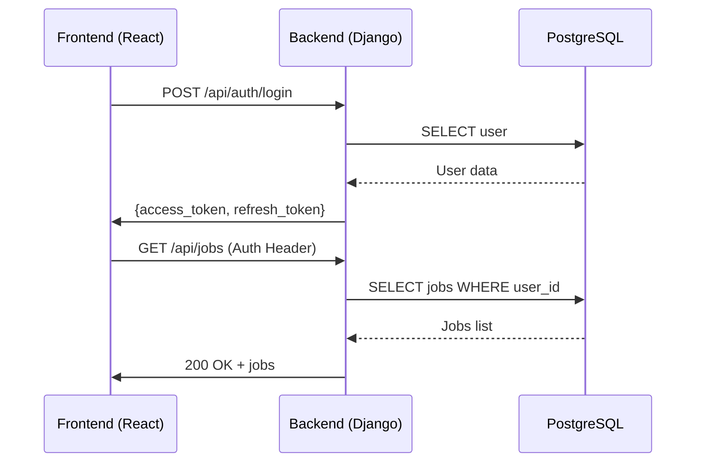
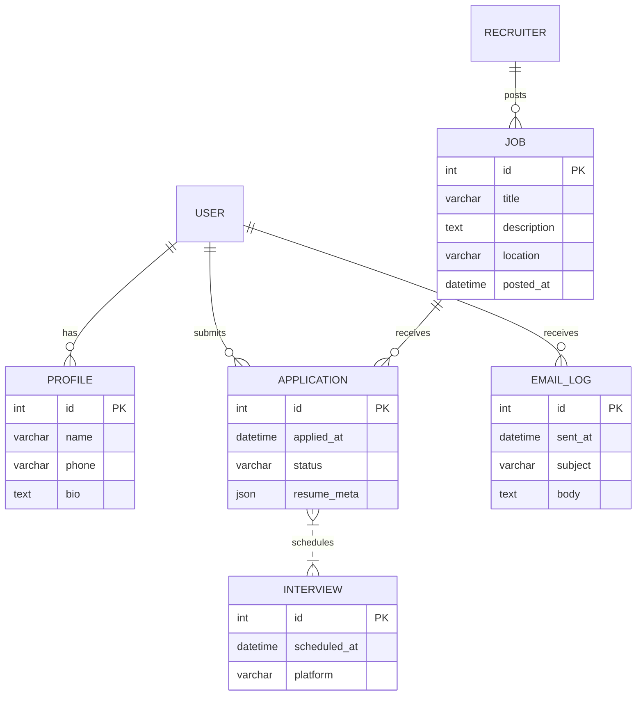
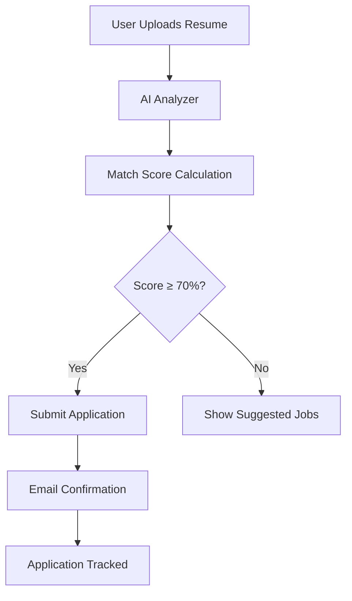

# <p align="center">
</p>

---  

## <p align="center">Smart Job Tracker</p>

### <p align="center">AI‑powered SaaS Job Application Tracking Platform</p>

---  

## Badges  

|  |  |
|---|---|
|  |  |
|  |  |
|  |  |
|  |  |

---  

## Hero Banner  


---  

## Overview  

Smart Job Tracker is a **full‑stack, AI‑enhanced SaaS platform** that empowers job seekers and recruiters to manage the entire recruitment lifecycle—from resume upload and automatic skill extraction to interview scheduling, real‑time analytics, and automated email reminders. Built with a modern **React‑Vite** front‑end, a **Django‑REST** back‑end, and **JWT**‑based role‑driven security, the system scales horizontally on **PostgreSQL** and **Redis**, and can be deployed seamlessly to **Vercel**, **Render**, or **AWS**.

> **💡 Goal:** Provide a frictionless, data‑driven experience that turns every job application into actionable intelligence.

---  

## Demo  

[](https://www.youtube.com/watch?v=VIDEO_ID)  
*A 2‑minute walkthrough of the core user & admin flows.*

---  

## Features  

| ✅ | Feature |
|---|---|
| 🔐 | **JWT Authentication** with refresh tokens |
| 👤 | **User Dashboard** – personalized job timeline |
| 🏢 | **Recruiter / Admin Dashboard** – hiring pipeline management |
| 📄 | **Resume Upload & AI Analyzer** (extracts skills, experience, scores) |
| 📅 | **Interview Scheduling** (Calendly‑style integration) |
| 📧 | **Email & SMS Notifications** (status changes, reminders) |
| ⏰ | **Reminder System** – smart nudges for pending actions |
| 📊 | **Analytics Dashboard** – KPI visualizations (applications per source, conversion rates) |
| 🌐 | **RESTful APIs** – OpenAPI spec, versioned |
| 🎨 | **SaaS UI/UX** – responsive, dark‑mode ready |
| 🛡️ | **Role‑Based Access Control** (RBAC) |
| 🔄 | **Continuous Integration / Delivery** (GitHub Actions) |
| ☁️ | **Scalable Deployments** (Vercel, Render, AWS) |

---  

## Authentication Flow  

```mermaid
flowchart TD
    A[Client] -->|Login Request| B[Auth Service (Django)]
    B -->|Validate Credentials| C{DB}
    C -->|Success| D[Issue Access & Refresh JWT]
    D -->|Set HttpOnly Cookie| A
    A -->|Authenticated Calls| E[Protected API]
    E -->|Verify JWT| B
    B -->|Refresh Token| F[Refresh Endpoint]
    F -->|Issue New Access Token| A
```

---  

## Admin Dashboard  

- **Recruiter Management** – create, edit, deactivate recruiters.  
- **Job Posting Board** – CRUD jobs, set status, attach interview stages.  
- **Applicant Pipeline** – Kanban view (New → Reviewed → Interview → Offer → Hired).  
- **Analytics** – conversion funnels, source attribution, time‑to‑hire.  
- **System Settings** – email templates, reminder policies, AI model selection.

---  

## User Features  

- **Smart Resume Upload** – instant skill extraction & match score.  
- **Application Tracker** – timeline view, status updates, notes.  
- **Interview Scheduler** – pick slots, sync with Google Calendar.  
- **Notifications Hub** – email / in‑app alerts.  
- **Personalized Insights** – AI‑driven suggestions for next steps.

---  

## Tech Stack  

| Layer | Technology |
|---|---|
| **Frontend** | React 18, Vite, Tailwind CSS, Axios, React‑Router‑DOM |
| **Backend** | Python 3.11, Django 4.2, Django‑REST‑Framework, djangorestframework‑simplejwt |
| **Database** | PostgreSQL 16, Redis 7 (caching & job queues) |
| **Auth** | JWT (access + refresh), HttpOnly cookies |
| **AI** | OpenAI GPT‑4o (resume parsing), LangChain orchestrations |
| **CI/CD** | GitHub Actions (lint, test, build, deploy) |
| **Hosting** | Vercel (frontend), Render/AWS (backend, DB) |
| **Testing** | Jest, React Testing Library, PyTest, coverage |

---  

## Folder Structure  

```
smart-job-tracker/
├─ .github/                # GitHub Actions workflows
│   └─ ci.yml
├─ backend/
│   ├─ manage.py
│   ├─ smart_job_tracker/
│   │   ├─ __init__.py
│   │   ├─ settings.py
│   │   ├─ urls.py
│   │   └─ wsgi.py
│   ├─ apps/
│   │   ├─ users/
│   │   ├─ jobs/
│   │   └─ analytics/
│   └─ requirements.txt
├─ frontend/
│   ├─ index.html
│   ├─ src/
│   │   ├─ main.jsx
│   │   ├─ App.jsx
│   │   ├─ routes/
│   │   └─ components/
│   ├─ vite.config.ts
│   └─ tailwind.config.cjs
├─ docs/
│   └─ architecture.md
├─ scripts/
│   └─ deploy.sh
├─ .env.example
├─ LICENSE
└─ README.md
```

---  

## Installation  

### Prerequisites  

- **Node ≥ 18**  
- **Python ≥ 3.11**  
- **Docker** (optional, for local DB)  
- **Git**  

---  

### Frontend Setup  

```bash
# Clone repo
git clone https://github.com/your-username/smart-job-tracker.git
cd smart-job-tracker/frontend

# Install dependencies
npm install

# Run dev server
npm run dev   # Vite dev server at http://localhost:5173
```

---  

### Backend Setup  

```bash
cd ../backend
python -m venv venv
source venv/bin/activate   # Windows: venv\Scripts\activate
pip install -r requirements.txt

# Apply migrations
python manage.py migrate

# Create superuser (admin)
python manage.py createsuperuser

# Run server
python manage.py runserver   # http://localhost:8000
```

---  

## Environment Variables  

| Variable | Description | Example |
|---|---|---|
| `DJANGO_SECRET_KEY` | Django secret key | `super-secret-key` |
| `POSTGRES_DB` | PostgreSQL DB name | `smartjobdb` |
| `POSTGRES_USER` | DB user | `postgres` |
| `POSTGRES_PASSWORD` | DB password | `password` |
| `POSTGRES_HOST` | DB host | `localhost` |
| `REDIS_URL` | Redis connection string | `redis://localhost:6379/0` |
| `JWT_SECRET_KEY` | JWT signing secret | `jwt-secret` |
| `OPENAI_API_KEY` | OpenAI key for resume analysis | `sk-...` |
| `VITE_API_URL` | Front‑end API endpoint | `http://localhost:8000/api/` |
| `EMAIL_HOST` | SMTP host | `smtp.sendgrid.net` |
| `EMAIL_HOST_USER` | SMTP user | `apikey` |
| `EMAIL_HOST_PASSWORD` | SMTP password | `SG.xxxxx` |

---  

## API Endpoint Flow  



---  

## Database ER Diagram  



---  

## Deployment  

| Platform | Steps |
|---|---|
| **Vercel (Frontend)** | 1. Connect repo  <br>2. Set `VITE_API_URL` to production backend URL  <br>3. Deploy (auto‑detects Vite) |
| **Render (Backend)** | 1. Create a *Web Service* <br>2. Set build command `pip install -r requirements.txt && python manage.py collectstatic` <br>3. Set start command `gunicorn smart_job_tracker.wsgi:application` <br>4. Add environment vars (see table) |
| **AWS (Alternative)** | 1. Use **ECS** + **RDS** for containers <br>2. Store secrets in **AWS Secrets Manager** <br>3. Use **ALB** for HTTPS termination |

---  

## Screenshots  

|  |  |
|---|---|
| *User Dashboard* | *Admin Dashboard* |
|  |  |
| *Analytics Overview* | *AI‑Powered Resume Analyzer* |

---  

## Future Improvements  

- **AI‑Driven Job Matching** – recommend openings based on resume & skill gaps.  
- **Multilingual Support** – translate UI & email notifications.  
- **Advanced Scheduler** – integrate with Outlook & Calendly APIs.  
- **SLA Monitoring** – Prometheus + Grafana dashboards for ops.  
- **Mobile Apps** – React Native front‑ends for iOS/Android.  

---  

## Contributing  

We welcome contributions! Please follow these steps:

1. Fork the repository.  
2. Create a feature branch (`git checkout -b feat/awesome-feature`).  
3. Ensure code passes linting (`npm run lint`, `flake8`).  
4. Write unit/integration tests & achieve ≥ 80 % coverage.  
5. Open a Pull Request with a clear description and reference the issue.  

Read our full [CONTRIBUTING.md](https://github.com/your-username/smart-job-tracker/blob/main/CONTRIBUTING.md) for style guides and the code of conduct.

---  

## License  

Distributed under the **MIT License**. See `LICENSE` for more information.

---  

## Full‑Stack Architecture  

```mermaid
graph LR
    subgraph Frontend
        FE[React (Vite) UI]
    end
    subgraph Backend
        BE[DJANGO REST API]
        AUTH[JWT Auth Service]
        AI[Resume Analyzer (OpenAI)]
        EMAIL[Celery + Redis Mail Worker]
    end
    subgraph DB
        PG[PostgreSQL]
        RD[Redis Cache]
    end
    FE -->|Axios| BE
    BE -->|Auth| AUTH
    BE -->|AI Calls| AI
    BE -->|Queue| EMAIL
    BE -->|ORM| PG
    EMAIL -->|Cache| RD
    AI -->|Cache| RD
    AUTH -->|Validate| PG
```

---  

## Order/Application Workflow  



---  

## Footer  

<p align="center">
  <a href="https://github.com/sridharSTR"></a>
  <br>
  Made by **sridhar manohar** – © 2026 Smart Job Tracker
</p>

---  
